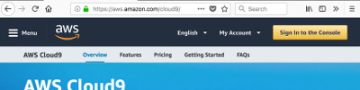
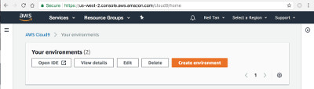
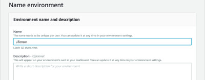
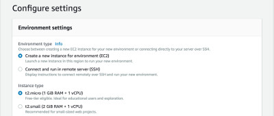
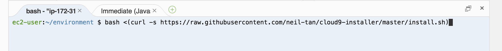

# uTensor + Mbed + Cloud9 Setup Script

## Introduction

  This script will install uTensor-CLI and Mbed-CLI on Cloud9 IDE. Installation takes only one line in the cloud:

  `bash <(curl -s https://raw.githubusercontent.com/neil-tan/cloud9-installer/master/install.sh)`
  
  It jump-starts the development process by automating the environment setup in the cloud. It contains the tools needed to create device binaries and data files from Tensorflow models.

 
## Steps

### Register a Cloud9 account
- Go to [Cloud9](https://aws.amazon.com/cloud9/) and register  an account

### Create an Environment
- Create an environment from the Cloud9 Dashboard

- Give the instance a name

- Create an instance on EC2 and choose the Free-tier

- Click on Next

- Click on Create

### Run the Command
- Run the command

`bash <(curl -s https://raw.githubusercontent.com/neil-tan/cloud9-installer/master/install.sh)`

Let the script run

  
## What's Next?
Try the quick-start guide
